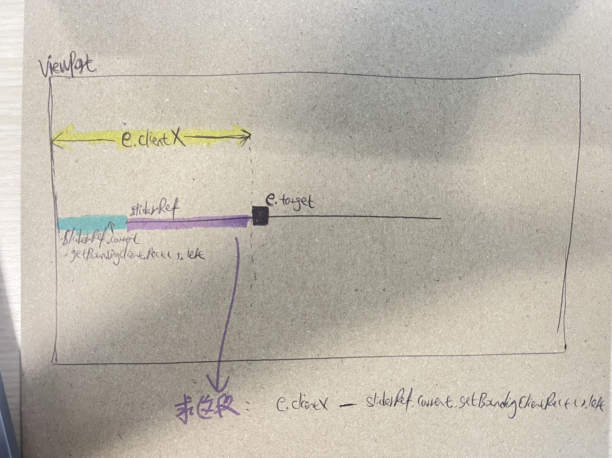

## 👨‍👧 组件关系

```
<SliderWrapper>
    <Slider/>
  <SliderWrapper/>
```

## 🔢 各组件的 state, props

- ### `SliderWrapper`: 无作用，只是提供初始值给 Slider 组件

  - states && props: 无

- ### `Slider`

  - props:
    - `initial` - number: 初始值
    - `onChange` - function: 滑动子组件 Slider 时触发的 callback function, 父组件 SliderWrapper 决定`onChange`内部怎么做,子组件只调用。
  - states：
    - `percentage` - number, 范围在`[0,100]`, 表示当前 Slider 滑块的位置

## 💭 思路

1. 先把 UI 写好，确定 CSS 哪些属性需要组件动态控制，这道题就是 span 的`left`需要动态设置
2. 确定触发滑动，滑动中，滑动结束的相对应事件们：`onMouseDown (mousedown)` --> `onMouseMove (mousemove)` --> `onMouseUp (mouseup)`
3. 再一一确定事件的内部逻辑：

   1. `onMouseDown (mousedown)` : 用户按住滑块时触发，此时需要给全局`document` 添加`mousemove`,`mouseup`事件和相对应的 event handling`handleMouseMove`,`handleMouseUp`去确保用户能滑动和停止滑动。
   2. 定义`handleMouseMove`内部逻辑目的：逐步确定新的`percentage`让滑块滑动, 那么如何计算新的`percentage`,那就是简单的数学了:

      > 当前滑块相对 Slider 最左水平坐标 / (Slider 长度-滑块长度) = new percentage

      1. `当前滑块相对Slider左边缘的位置 = 当前滑块相对viewport的水平坐标 - Slider最左水平坐标`
      2. 通过`e.clientX`来获取当前滑动处,相对 viewport 的水平坐标
      3. 至于怎么拿到 Slider 最左水平坐标和其长度? - 那就得用`useRef`创造出`sliderRef`
         1. 通过`sliderRef.current`来获取和`sliderRef`挂钩的 DOM 元素
         2. 通过`sliderRef.current.getBoundingClientRect().left`来获取 Slider 最左水平坐标
         3. 通过`sliderRef.current.getBoundingClientRect().width`来获取 Slider 的长度

## 💃 CSS

这道题 CSS 和基本的 Progress bar 很类似，思路就是一个外层 div container, 包了一个内层 div, 不同点是 Progress bar 控制内层 div 的 css 属性`transform: scaleX(百分比%)`，Slider 是内层 div 还嵌套一个 span, 控制 span css 属性`left: calc(百分比%)`

## 👀 知识点

1. `useRef`的使用
2. `.getBoundingClientRect()`的使用

## ♿ Accessibility (a11y)

- 进度条本身可以加`role = progressbar`
- 加`aria`属性， 比如`aria-valuemin`,`aria-valuemax`,`aria-valuenow`s
